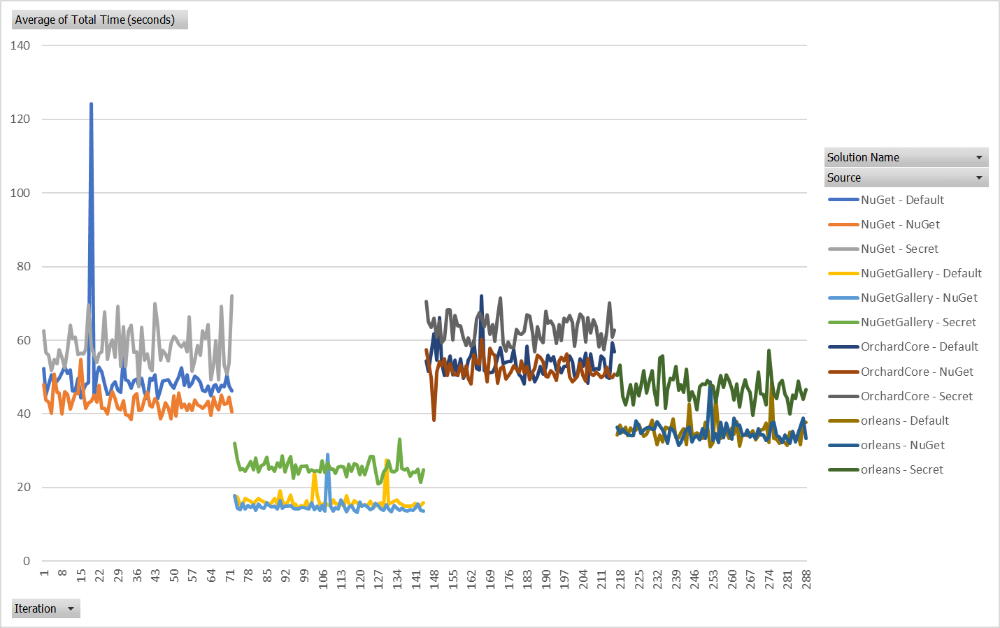
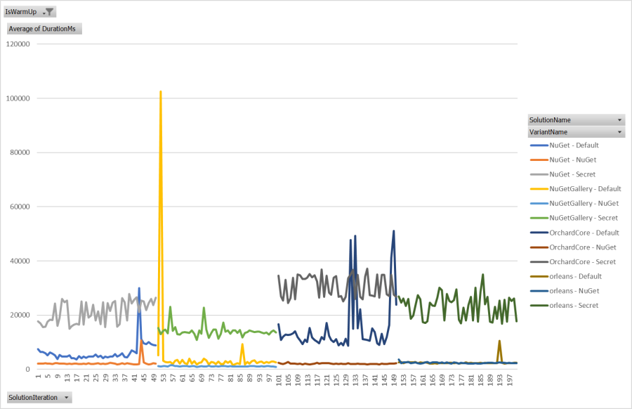

# RestorePerf

Test tools for measuring the speed of a NuGet package server implementation.

## Purpose

This repository contains several tools for measuring the performance of a package source. It's important for the NuGet
team to measure *restore* performance. Measuring the performance of client code is less important to this effort.

These test tools can be used to compare the performance of alternate package source implementations.

*Example performance comparison (nuget.exe restore): 4 test solutions, 3 source configurations, 50 iterations.*



*Example performance comparison (request replay): 4 test solutions, 3 source configurations, 50 iterations.*



As you can see, the slowness of the "Secret" package source is more visible when measured without the overhead of the
rest of a NuGet restore operation.

## More reading

- [Request graph](docs/request-graph.md) - the idea behind improving test reproducibility
- [Example request graph](docs/ExampleProj-out/graphs/20-logs.json) - a serialized dependency graph of HTTP requests

## Instructions

### Gather all packages used by the test cases

The first step is to gather all versions of all package IDs requested in a package restore.

```powershell
.\discover-packages.ps1
```

This will run a warm-up restore on all of the test repositories. After each restore, the downloaded .nupkg files will
be gathered into `.\out\nupkgs`. This allows a subsequent step to push all packages needed for the restore to the
package source that will be tested.

Then, the `.\src\PackageHelper\PackageHelper.csproj` project will be executed with the `download-all-versions` argument
to fetch all versions of package IDs hit during the warm-up restores. We want all the versions because some endpoints
hit during restore have a list of all versions. We want these payloads to be the appropriate size, instead of just
containing the versions fetched during restore.

**Example test case:** [Test-ExampleProj.ps1](test/testCases/Test-ExampleProj.ps1)

### Push all gathered packages to the test source

```powershell
dotnet run `
    push "https://my-source/v3/index.json" `
    --framework netcoreapp3.1 `
    --project .\src\PackageHelper\PackageHelper.csproj
```

This will push all of the packages in `.\out\nupkgs` to the provided source. The provided source will be used for both
pushing and for listing existing versions (to avoid pushing duplicates).

If you want to use a different source URL for listing versions, pass a second source URL:

```powershell
dotnet run `
    push "https://my-push-source/api/v2/package" `
    --list-source "https://my-source/v3/index.json" `
    --framework netcoreapp3.1 `
    --project .\src\PackageHelper\PackageHelper.csproj
```

If you want to provide an API key for pushing, provide it after a second source URL:

```powershell
dotnet run `
    push "https://my-push-source/api/v2/package" `
    --list-source "https://my-source/v3/index.json" `
    --api-key "MY_API_KEY" `
    --framework netcoreapp3.1 `
    --project .\src\PackageHelper\PackageHelper.csproj
```

### Run the tests

Use the `.\run-tests.ps1` script to run a series of clean restores on the Git repositories checked in to
`.\scripts\perftests\testCases`.

```powershell
.\run-tests.ps1 `
    -resultsName "combined" `
    -iterations 5 `
    -variantName "mysource" `
    -sources @("https://my-source/v3/index.json")
```

The `-resultsName` parameter will be used to change the results CSV name. It is written to
`.\out\results-{resultsName}.csv`. If you are testing multiple sets of sources, it's probably easiest to use one 
value for this parameter across all invocations so all of the data goes into one CSV file.

The `-variantName` parameter will be used to mark each row written to the results CSV. It will also be included in the
restore log file name: `.\out\logs\restoreLog-{variantName}-{solutionFileName}-{timestamp}.txt`. If you are comparing
multiple sets of sources, it's best to have one variant name for set of sources, e.g. `mytestsource1` and
`mytestsource2`.

The `-sources` parameter is used to specific a list of sources to use for all of the restores. These sources will
replace the sources that are used by the test repositories by default.

**Example restore log:** [restoreLog-nuget-ExampleProj-20200522T2242473395.txt](docs/ExampleProj-out/logs/restoreLog-nuget-ExampleProj-20200522T2242473395.txt)

### Parse the logs

To eliminate overhead in a NuGet restore from sources other than HTTP requests (such as disk, memory, or CPU
bottlenecks), you can parse the restore logs to generate a dependency graph of HTTP requests. This graph can be used
to replay all the requests needed for a restore outside of the context of a real restore operation.

Use the following command to parse all the restore logs generating when running the tests (via `.\run-tests.ps1`,
described above). The logs that will be parsed are in `.\out\logs`.

```powershell
dotnet run `
    parse-restore-logs `
    --framework netcoreapp3.1 `
    --project .\src\PackageHelper\PackageHelper.csproj
```

All graphs generated from logs with same  **solution name**, **variant name**, and **set of sources** will be merged.
Merging multiple logs allows the HTTP request dependency graph to be closer to reality (i.e. the HTTP requests resulting
from the real graph known by NuGet restore). In other words, the more logs you parse, the more accurate your simulated
request graph will be.

This command will produce serialized request graphs in the `.\out\graphs` directory. The file name format is:

```
.\out\graphs\requestGraph-{variantName}-{solutionName}.json.gz
```

Note that the set of sources is not encoded into the file name. It's best to use the variant name to distinguish between
different sets of sources so that request graphs with the same variant name and solution name but different sources
don't overwrite each other.

**Example request graph JSON:** [requestGraph-nuget-ExampleProj.json](docs/ExampleProj-out/graphs/requestGraph-nuget-ExampleProj.json) (gzipped, for clarity)

### Replay a request graph

After you have parsed a request graph from the restore logs, you can replay it to test the raw HTTP time spent on the
restore.

```powershell
dotnet run `
    replay-request-graph ".\out\graphs\requestGraph-mysource-OrchardCore.json.gz" `
    --iterations 20 `
    --framework netcoreapp3.1 `
    --project .\src\PackageHelper\PackageHelper.csproj
```

This example command will replay the request graph for the `mysource` variant name, `OrchardCore` solution name.

**Example results CSV:** [replay-results.csv](docs/ExampleProj-out/replay-results.csv)

**Example log CSV:** [replayLog-nuget-ExampleProj-20200526T0451555600.csv](docs/ExampleProj-out/logs/replayLog-nuget-ExampleProj-20200526T0451555600.csv)

### Generate an operation graph

Once you have a request graph you're happy with, you can convert it to a generic "operation graph". A request graph
describes the dependencies between specific HTTP requests so a (NuGet) operation graph describes the dependencies
between parameterized NuGet HTTP API operations. A simple transformation is applied to a request graph to produce the
operation graph so that you can easily switch the package source referred to by the graph.

```powershell
dotnet run `
    convert-graph ".\out\graphs\requestGraph-mysource-OrchardCore.json.gz" `
    --no-variant-name `
    --framework netcoreapp3.1 `
    --project .\src\PackageHelper\PackageHelper.csproj
```

This example would produce a `.\out\graphs\operationGraph-OrchardCore.json.gz` file.

**Example operation graph JSON:** [operationGraph-ExampleProj.json](docs/ExampleProj-out/graphs/operationGraph-ExampleProj.json) (gzipped, for clarity)

### Generate a request graph from an operation graph

Once you have an operation graph, you can generate a request graph from it with any package source you want.

```powershell
dotnet run `
    convert-graph ".\out\graphs\operationGraph-OrchardCore.json.gz" `
    --variant-name nuget `
    --sources "https://api.nuget.org/v3/index.json" `
    --framework netcoreapp3.1 `
    --project .\src\PackageHelper\PackageHelper.csproj
```

This command would generate a new request graph with the package source of nuget.org, instead of the "mysource" source
used to generate the original request graph in the example above. From here, you can generate a request graph for as
many sources as you want with the same operation graph.

## Caveats

There are some known caveats to this replay approach. Most notably, any request that is cancelled by NuGet
restore (perhaps because a package is found on one feed before the other requests complete) but still logged will be
fully executed during the replay. This means that the time spent on HTTP by the replay is more of an upper bound than an
exact replay. A restore with a single source will have no such problem because cancellation will not occur.

Another caveat is that this idea of replaying requests from parsed logs may be completely ludicrous. There's always
that. It seems fine on paper... but... maybe I'm missing something?

## Acknowledgements 

The perf scripts are copied and modified from the
[NuGet/NuGet.Client](https://github.com/NuGet/NuGet.Client/tree/dev/scripts/perftests) repository. Thanks for the
starting point, friends!
