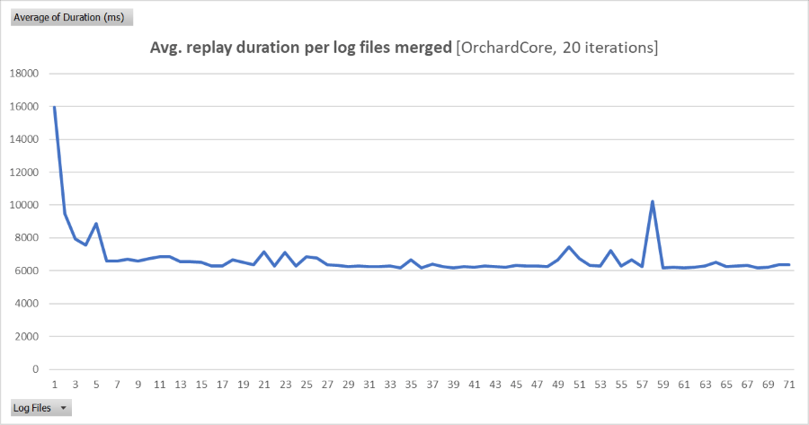

# RestorePerf

Test tools for measuring the speed of a NuGet package server implementation.

## Purpose

This repository contains several tools for measuring the performance of a package source. In particular, it's important
for the NuGet team to measure *restore* performance. Measuring the performance of client code is less important to this
effort.

These test tools can be used to compare the performance of alternate package source implementations.

*Example performance comparison: 4 test solutions, 3 source configurations, 50 iterations.*


## Instructions

### Gather all packages used by the test cases

The first step is to gather all versions of all package IDs requested in a package restore.

```powershell
.\discover-packages.ps1
```

This will run a warm-up restore on all of the test repositories. After each restore, the downloaded .nupkg files will
be gathered into `.\out\nupkgs`. This allows a subsequent step push all packages needed for the restore to the package
source that will be tested.

Then, the `.\src\PackageHelper\PackageHelper.csproj` project will be executed with the `download-all-versions` argument
to fetch all versions of package IDs hit during the warm-up restores. We want all of the versions because some endpoints
hit during restore have a list of all versions. We want these payloads to be the appropriate size, instead of just
containing the versions actually fetched during restore.

### Push all gathered packages to the test source

```powershell
dotnet run `
    push "https://my-source/v3/index.json" `
    --project .\src\PackageHelper\PackageHelper.csproj
```

This will push all of the packages in `.\out\nupkgs` to the provided source. The provided source will be used for both
pushing and for listing existing versions (to avoid pushing duplicates).

If you want to use a different source URL for listing versions, pass a second source URL:

```powershell
dotnet run `
    push "https://my-push-source/api/v2/package" "https://my-source/v3/index.json" `
    --project .\src\PackageHelper\PackageHelper.csproj
```

If you want to provide an API key for pushing, provide it after a second source URL:

```powershell
dotnet run `
    push "https://my-push-source/api/v2/package" "https://my-source/v3/index.json" "MY_API_KEY" `
    --project .\src\PackageHelper\PackageHelper.csproj
```

### Run the tests

Use the `.\run-tests.ps1` script to run a series of clean restores on the Git repositories checked in to
`.\scripts\perftests\testCases`.

```powershell
.\run-tests.ps1 `
    -resultsName "combined" `
    -iterationCount 5 `
    -variantName "mysource" `
    -sources @("https://my-source/v3/index.json")
```

The `-resultsName` parameter will be used to change the results CSV name. It is written to
`.\out\results-{resultsName}.csv`. If you are testing multiple sets of sources, it's probably easiest to use one 
value for this parameter acrosss all invocations so all of the data goes into one CSV file.

The `-variantName` parameter will be used to mark each row written to the results CSV. It will also be included in the
restore log file name: `.\out\logs\restoreLog-{variantName}-{solutionFileName}-{timestamp}.txt`. If you are comparing
multiple sets of sources, it's best to have one variant name for set of sources, e.g. `mytestsource1` and
`mytestsource2`.

The `-sources` parameter is used to specific a list of sources to use for all of the restores. These sources will
replace the sources that are used by the test repositories by default.

### Parse the logs

In order to eliminate overhead in a NuGet restore from sources other than HTTP requests (such as disk, memory, or CPU
bottlenecks), you can parse the restore logs to generate a dependency graph of HTTP requests. This graph can be used
to replay all of the requests needed for a restore outside of the context of a real restore operation.

Use the following command to parse all of the restore logs generating when running the tests (via `.\run-tests.ps1`,
described above). The logs that will be parsed are in `.\out\logs`.

```powershell
dotnet run `
    parse-restore-logs `
    --project .\src\PackageHelper\PackageHelper.csproj
```

All graphs generated from logs with same  **solution name**, **variant name**, and **set of sources** will be merged.
Merging multiple logs allows the HTTP request dependency graph to be closer to reality (i.e. the HTTP requests resulting
from the real graph known by NuGet restore). In other words, the more logs you parse, the more accurate your simulated
request graph will be.

This command will produce serialized request graphs in the `.\out\request-graphs` directory. The file name format is:

```
.\out\request-graphs\requestGraph-{variantName}-{solutionName}.json.gz
```

Note that the set of sources is not encoded into the file name. It's best to use the variant name to distinguish between
different sets of sources so that request graphs with the same variant name and solution name but different sources
don't overwrite each other.

#### How many request logs should I parse?

Well, from my experimentation, 10 logs looks like enough and 20 is more than sufficient. The following script
incrementally tests merging more and more request logs and then tests the time it takes to replay the request graph.

```powershell
.\test-log-merge-asymptote.ps1 `
    -iterationCount 20 `
    -variantName "mysource" `
    -solutionName "OrchardCore"
```

Unsurprisingly, the average time to replay the request graph is asymtotal with respect to the number of logs merged.
This picture below went up to 70 request logs merged. Very quickly, the total request duration approached just over
6 seconds.



### Replay a request graph

After you have parsed a request graph from the restore logs, you can replay it to test the raw HTTP time spent on the
restore.

```powershell
dotnet run `
    replay-request-graph ".\out\request-graphs\requestGraph-mysource-OrchardCore.json.gz" 20 `
    --project .\src\PackageHelper\PackageHelper.csproj
```

This example command will replay the request graph for the `mysource` variant name, `OrchardCore` solution name. It 
will perform 20 iterations (via the `20` argument).

## Acknowledgements 

The perf scripts are copied and modified from the
[NuGet/NuGet.Client](https://github.com/NuGet/NuGet.Client/tree/dev/scripts/perftests) repository. Thanks for the
starting point, friends!
