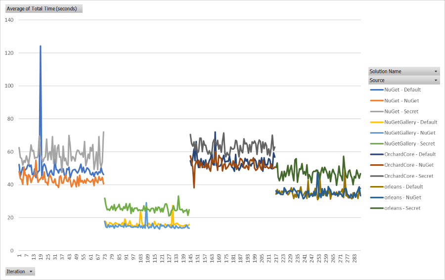

# RestorePerf

Test tools for measuring the speed of a NuGet package server implementation.

## Purpose

This repository contains several tools for measuring the performance of a package source. In particular, it's important
for the NuGet team to measure *restore* performance. Measuring the performance of client code is less important to this
effort.

These test tools can be used to compare the performance of alternate package source implementations.

*Example performance comparison: 4 test solutions, 3 source configurations, 50 iterations.*



## Instructions

### Gather all packages used by the test cases

The first step is to gather all versions of all package IDs requested in a package restore.

```powershell
.\discover-packages.ps1
```

This will run a warm-up restore on all of the test repositories. After each restore, the downloaded .nupkg files will
be gathered into `.\out\nupkgs`. This allows a subsequent step push all packages needed for the restore to the package
source that will be tested.

Then, the `.\src\PackageHelper\PackageHelper.csproj` project will be executed with the `download-all-versions` argument
to fetch all versions of package IDs hit during the warm-up restores. We want all of the versions because some endpoints
hit during restore have a list of all versions. We want these payloads to be the appropriate size, instead of just
containing the versions actually fetched during restore.

### Push all gathered packages to the test source

```powershell
dotnet run `
    push "https://my-source/v3/index.json" `
    --project .\src\PackageHelper\PackageHelper.csproj
```

This will push all of the packages in `.\out\nupkgs` to the provided source. The provided source will be used for both
pushing and for listing existing versions (to avoid pushing duplicates).

If you want to use a different source URL for listing versions, pass a second source URL:

```powershell
dotnet run `
    push "https://my-push-source/api/v2/package" "https://my-source/v3/index.json" `
    --project .\src\PackageHelper\PackageHelper.csproj
```

If you want to provide an API key for pushing, provide it after a second source URL:

```powershell
dotnet run `
    push "https://my-push-source/api/v2/package" "https://my-source/v3/index.json" "MY_API_KEY" `
    --project .\src\PackageHelper\PackageHelper.csproj
```

### Run the tests

Use the `.\run-tests.ps1` script to run a series of clean restores.

```powershell
.\run-tests.ps1 `
    -resultsName "combined" `
    -iterationCount 5 `
    -variantName "my-source" `
    -sources @("https://my-source/v3/index.json")
```

The `-resultsName` parameter will be used to change the results CSV name. It is written to
`.\out\results-{resultsName}.csv`. If you are testing multiple sets of sources, it's probably easiest to use one 
value for this parameter acrosss all invocations so all of the data goes into one CSV file.

The `-variantName` parameter will be used to mark each row written to the results CSV. It will also be included in the
restore log file name: `.\out\logs\restoreLog-{variantName}-{solutionFileName}-{timestamp}.txt`. If you are comparing
multiple sets of sources, it's best to have one variant name for set of sources, e.g. `my-test-source-1` and
`my-test-source-2`.

The `-sources` parameter is used to specific a list of sources to use for all of the restores. These sources will
replace the sources that are used by the test repositories by default.

## Acknowledgements 

The perf scripts are copied and modified from the
[NuGet/NuGet.Client](https://github.com/NuGet/NuGet.Client/tree/dev/scripts/perftests) repository. Thanks for the
starting point, friends!
