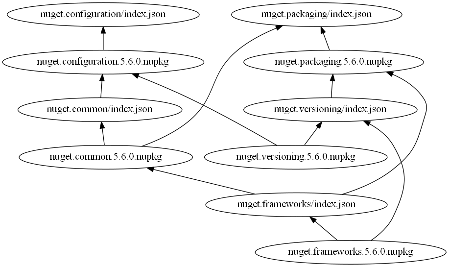
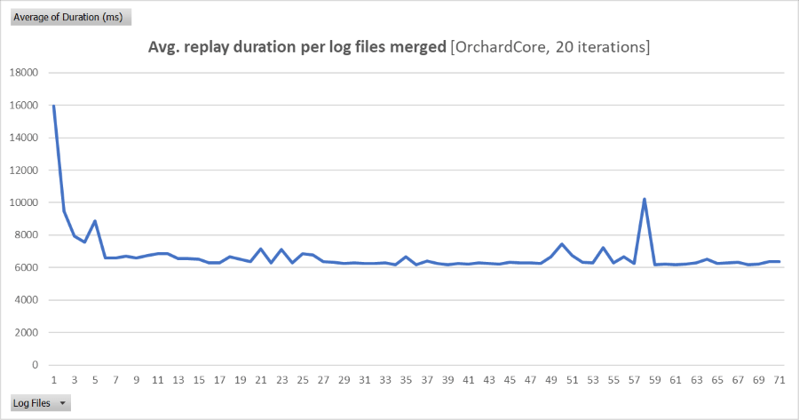

# Request graph

This project utilizes a potentially crazy idea of rebuilding a dependency graph of HTTP requests from an application's
output log. In particular, it parses the log produced by a full NuGet restore operation and generates a graph describing
which HTTP requests depend on each other based on the relative order of the "start" and "end" logs. I was inspired by
some reading about [process mining](https://en.wikipedia.org/wiki/Process_mining) but my approach is much simpler than
the novel techniques applied in that field. Also, I couldn't figure out how to discretize events like an HTTP request
into a useful form for process mining 🤷. 

The purpose of this madness is to efficiently test the performance of a NuGet package source and come up with a
performance number that reflects real impact on user experience (rather than just raw endpoint performance numbers).
In order to eliminate variables in NuGet restore performance that are unrelated to server-side performance (such as
client CPU, disk, memory), the HTTP requests executed by restore are replayed in the same order that they occurred in
restore, but without the gaps and pauses between said HTTP requests caused by the computational or IO effort required
for a NuGet restore.

This theoretically allows for more reproducable performance measurements for a NuGet package source. Also, test
run time should be shorter since we are performing less work in the "test loop".

## Example input

Consider a very simple C# project with two direct package dependencies and several transitive dependencies:

```
ExampleProj.csproj
├─ NuGet.Configuration
│  └─ NuGet.Common 
│     └─ NuGet.Frameworks
└── NuGet.Packaging
    ├─ Newtonsoft.Json
    ├─ NuGet.Configuration
    │  └─ NuGet.Common 
    │     └─ NuGet.Frameworks
    └─ NuGet.Versioning
```

When this project is restored, a series of HTTP requests are rattled off, enumerating available package versions,
discovering dependencies, and downloading package content.

The request log contains something like this:

```
  GET https://api.nuget.org/v3-flatcontainer/nuget.configuration/index.json
  GET https://api.nuget.org/v3-flatcontainer/nuget.packaging/index.json
  OK https://api.nuget.org/v3-flatcontainer/nuget.packaging/index.json 206ms
  OK https://api.nuget.org/v3-flatcontainer/nuget.configuration/index.json 236ms
  GET https://api.nuget.org/v3-flatcontainer/nuget.packaging/5.6.0/nuget.packaging.5.6.0.nupkg
  GET https://api.nuget.org/v3-flatcontainer/nuget.configuration/5.6.0/nuget.configuration.5.6.0.nupkg
  OK https://api.nuget.org/v3-flatcontainer/nuget.packaging/5.6.0/nuget.packaging.5.6.0.nupkg 36ms
  OK https://api.nuget.org/v3-flatcontainer/nuget.configuration/5.6.0/nuget.configuration.5.6.0.nupkg 41ms
  GET https://api.nuget.org/v3-flatcontainer/nuget.common/index.json
  GET https://api.nuget.org/v3-flatcontainer/nuget.versioning/index.json
  OK https://api.nuget.org/v3-flatcontainer/nuget.common/index.json 224ms
  GET https://api.nuget.org/v3-flatcontainer/nuget.common/5.6.0/nuget.common.5.6.0.nupkg
  OK https://api.nuget.org/v3-flatcontainer/nuget.versioning/index.json 216ms
  GET https://api.nuget.org/v3-flatcontainer/nuget.versioning/5.6.0/nuget.versioning.5.6.0.nupkg
  OK https://api.nuget.org/v3-flatcontainer/nuget.common/5.6.0/nuget.common.5.6.0.nupkg 35ms
  OK https://api.nuget.org/v3-flatcontainer/nuget.versioning/5.6.0/nuget.versioning.5.6.0.nupkg 36ms
  GET https://api.nuget.org/v3-flatcontainer/nuget.frameworks/index.json
  OK https://api.nuget.org/v3-flatcontainer/nuget.frameworks/index.json 103ms
  GET https://api.nuget.org/v3-flatcontainer/nuget.frameworks/5.6.0/nuget.frameworks.5.6.0.nupkg
  OK https://api.nuget.org/v3-flatcontainer/nuget.frameworks/5.6.0/nuget.frameworks.5.6.0.nupkg 32ms
```

*(note that Newtonsoft.Json is not downloaded because it is already available on my machine in a fallback folder)*

From this request log, we can generate a directed acyclic graph (DAG) representing all HTTP requests and their
relationship with each other. 

- The **node** is the request URL
- The **outgoing edges** for each node are to the requests higher up in the log that have completed
- Each **outgoing edge** can be considered a request dependency

This generates a very dense graph. As the log gets longer, the list of completed requests grows so
each new started request will depend on an ever grown lists of requests.

For example, this is the graph from that request log above:


*There are 40 total edges in this graph.*

## Multiple log files

With a single log file, the random ordering of parallelized HTTP requests is indistinguishable from intentionally
serialized requests. I have provided a way to merge the restore graphs from multiple logs. The merging logic of two
graphs *existing* and *new* is as follows:

1. For each node in the *new* graph that does not exist it the existing graph, add it and update dependency references
1. For each node in both graphs, the dependencies to be the of *existing* node to be the intersection of the two sets

### Multiple merges

Consider the example diagram above, which is the dependency graph after one restore. After performing 20 restores and
merging all of the resulting request graphs using the algorithm described above, the following red edges are pruned.


After removing the edges and letting Graphviz do it's magic 🤤, the graph looks like this:


*There are 29 total edges in this graph (11 less than before).*

## Transitive reduction

Given these lines represent dependencies, many of them can be removed because they are redundant. The process of
removing these extra edges is a well known process call [transitive reduction](https://en.wikipedia.org/wiki/Transitive_reduction).
After this is done, the graph looks much cleaner!



*There are 12 total edges in this graph (17 less than before).*

## Summary

If we observe the remaining dependencies in the reduced graph, they rougly correspond to the expected sequence of
HTTP requests used to discover all direct and transitive dependencies of the `ExampleProj.csproj` project used in this
example. Notably:

- The two root nodes relate to NuGet.Configuration and NuGet.Packaging, which are direct dependencies of the project.
- Specific NuGet package versions are only hit after the index for that ID is downloaded.
- Direct package dependecies are only discovered after downloading a package version, for example:
  - `nuget.common/index.json` is only hit after `nuget.configuration.5.6.0.nupkg` is downloaded
  - `nuget.versioning/index.json` is only hit after `nuget.packaging.5.6.0.nupkg` is downloaded
  - `nuget.frameworks/index.json` is only hit after `nuget.common.5.6.0.nupkg` is downloaded

In short, the generated dependency graph roughly corresponds to what HTTP requests we would expect to see NuGet
perform during a restore.

## Why is this interesting?

Well, you're the one that read this far, you tell me! Just kidding. This is interesting because it's a general purpose
approach to create an HTTP request plan from an output log that roughly respects the concurrency constraints of the
tool that produced the log 🤓. 

Not all HTTP requests take the same time (there are fast and slow endpoints, typically) so if there is an HTTP request
this is blocking the rest of work from happening and it's a very slow request, the entire operation is slowed down.
Consider a package dependency graph that is just a path: `A -> B -> C -> D` (i.e. no parallelism is possible) and
downloading the NuGet package of `B` is very slow. Well, that's going to affect the entire restore time more
dramatically than if all packages are downloaded in parallel from the beginning.

Simply parallelizing all requests found in the log and measuring the time all of those requests take to complete could
hide bottlenecks and give a falsely positive impression of how server performance is impacting users.

## How many request logs should be merged?

From my experimentation, 10 logs looks like enough and 20 is more than sufficient. The following script incrementally
tests merging more and more request logs and then tests the time it takes to replay the request graph.

```powershell
.\test-log-merge-asymptote.ps1 `
    -iterations 20 `
    -variantName "mysource" `
    -solutionName "OrchardCore"
```

Unsurprisingly, the average time to replay the request graph is asymtotal with respect to the number of logs merged.
This picture below went up to 70 request logs merged. Very quickly, the total request duration approached just over
6 seconds.



## Example data

The example data is available in this repository:

- [ExampleProj.csproj](ExampleProj/ExampleProj.csproj)
- Example restore logs, for example: [restoreLog-nuget-ExampleProj-20200522T2242473395.txt](ExampleProj-out/logs/restoreLog-nuget-ExampleProj-20200522T2242473395.txt)
- Graphviz files, for example: [20-logs.gv](ExampleProj-out/graphs/20-logs.gv)
- Restore graph JSON, for example: [20-logs.json](ExampleProj-out/graphs/20-logs.json)
